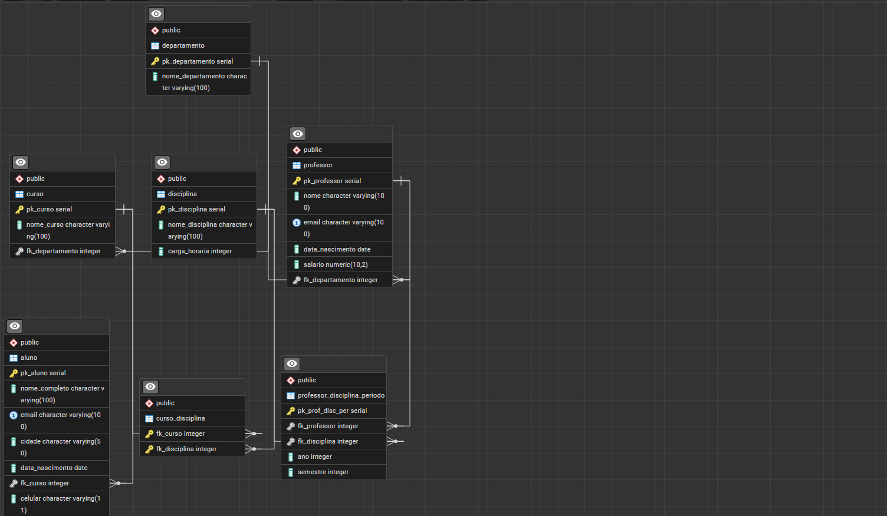

# Sistema de Banco de Dados - Gestão Escolar

Projeto de Banco de Dados, sistema para gerenciar uma escola (Básico).

## Utilizado

- Constraints
- Inner Join
- Inserts
- Alter

## Estrutura

- Alunos
- Curso
- Departamento
- Professor
- Curso_disciplina
- professor_disciplina_periodo

## Tecnologias

PostgreSQL
SQL

## Como executar

Execute o arquivo Query com o seu Banco de Dados.

## Diagrama

  

